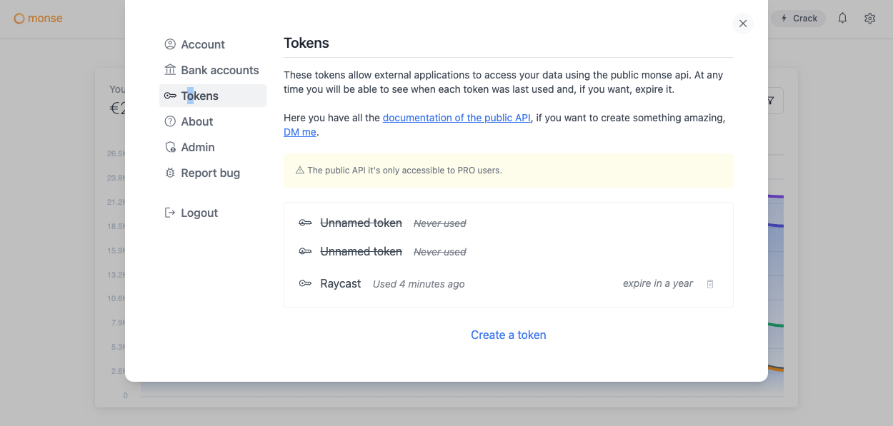

# Generate a token

## Generate a new token

The user can create, remove and watch all his tokens inside the settings panel in [monse.app](https://monse.app). These tokens expire 1 year after creation date. When a token expires, you will need to create a new one.


The public API it's a pro accounts feature. If the user doesn't have a pro account he can't access to their transactions or public data.

